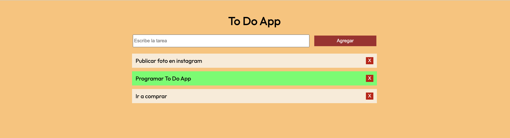

# To Do App

## Table of contents

- [Overview](#overview)
  - [Screenshot](#screenshot)
  - [Built with](#built-with)
- [Author](#author)

## Overview

This is a simple task list, where you can create tasks, mark them as completed, and delete them.

Link to the app: https://darling-semifreddo-c0aeea.netlify.app

### Screenshot

### Built with

- Semantic HTML5 markup
- CSS custom properties
- Flexbox
- CSS Grid
- JavaScript

## Author

- Twitter - [@charlsef23](https://www.twitter.com/@charlsef23)
- Instagram - [@charlsef23](https://www.instagram.com/charlsef23/)
